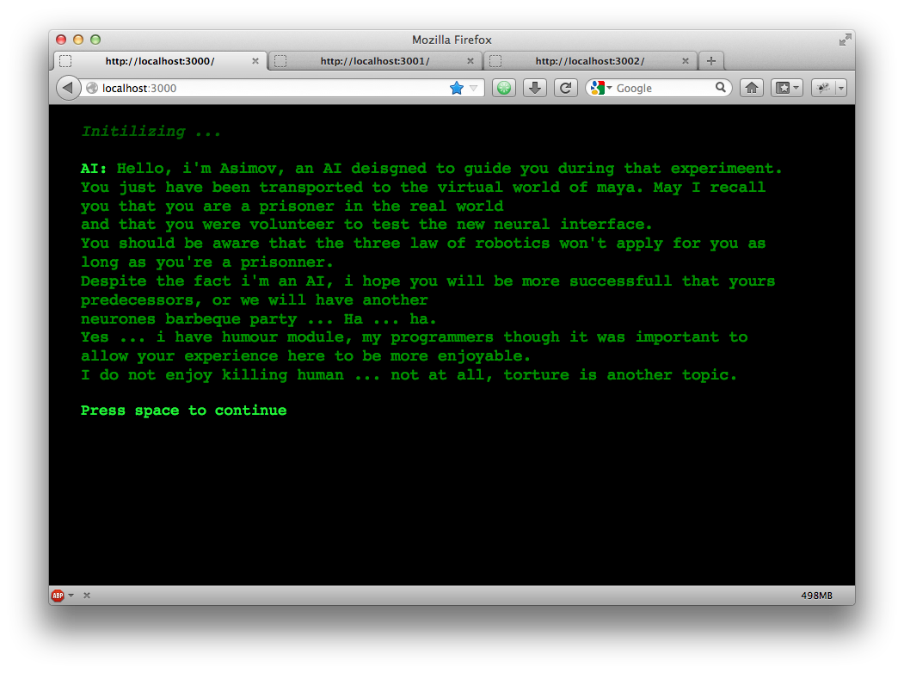

RETRO-CATZ
##########

Enjoy ;)

Description
===========
This game contains a unique experience where the player will play with in multiple inter-connected games in
different tabs.

The player will start with a text game: 

Will have then a second tab including 2 dimensions monochromes games

.. image:: src/public/img/cheated_pong.png

.. image:: src/public/img/da_square_moon.png

To finally have a classical rpg (cf: final fantasy VI, chrono trigger ..) in colors with animated sprites and a tmx map

(no screenshot, could spoil i think)

//TODO: More comment about the game later

Install
=======

npm install

node ./src/server.js

browse: http://localhost:3000

Requirements
============

Server:

  - Os Unix based (because of github clone commands, i'll try to test an fix, pm me if urgent)
  - node > v0.8.14

Client:

  - browser with full html5 support

Folder architecture
===================

*coffee*    = socket.io + express server script and backbone client script

*src*       = project sources.

  *data*    = data for game (maps, scenes, texts)

  *public*

    *game*

    *js*

    *img*

    *css*

  *views* 

*var*       = logs

Credits
=======
TODO: rewrite credits

List below is old, incomplete and maybe osolete
Joy tilset sources:
images from:
- Nomicom
- Enterbrain
- Shiro
- Kaduki
compiled by joy.
http://rmrk.net/index.php?topic=35095.0

Danc. 
http://www.lostgarden.com/2006/07/more-free-game-graphics.html

Post-dev Notes
==============
As long as our project had to be related with a github features, i had lots of idea.
My basic idea was to start creating a game generator, where you would have select features and 
character abilities and then compile them in branch. To do that i started with a very flexible
architecture using javascript prototyping + concepts of component-entity system architecture.
I was a bit short on time, and was afraid of not finishing before deadline, so I change the
objective to creating several games with several time interacting with each other through socket.io.
