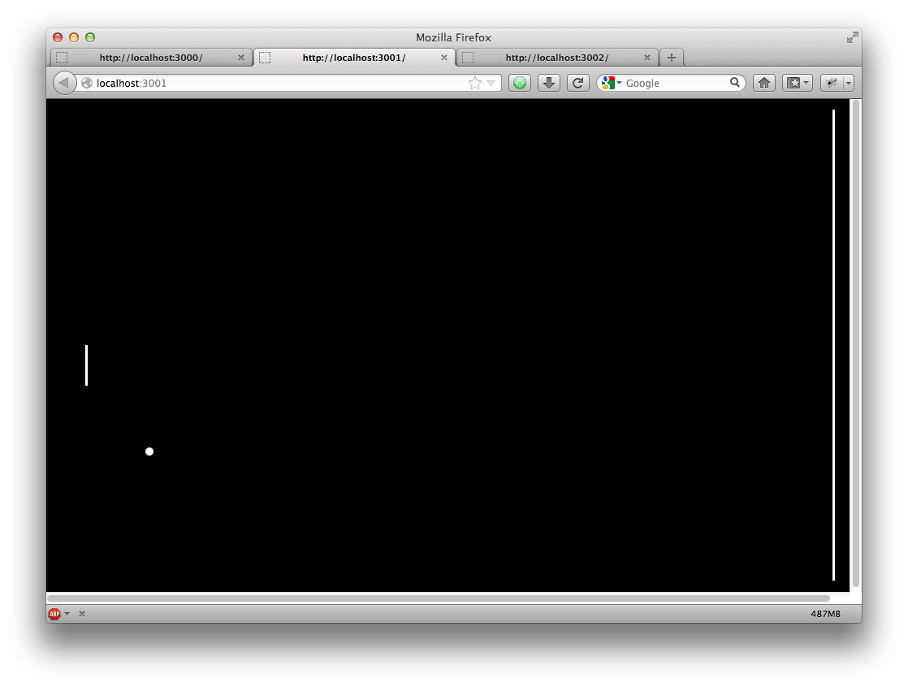
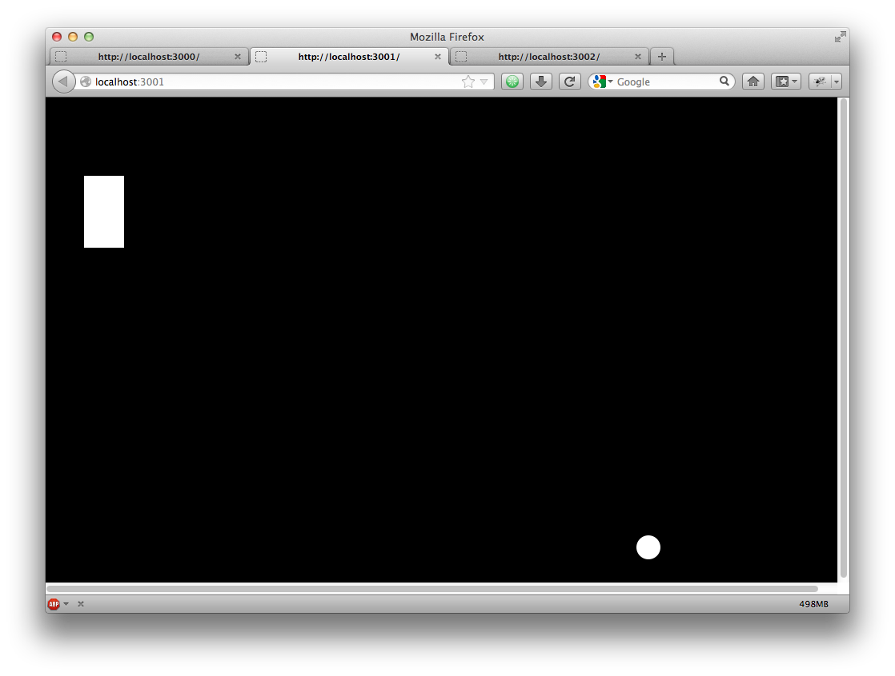

===========
RETRO-CATZ
===========
*Participation to the github game off 2012*

Enjoy ;)

Description
=========
This game contains a unique experience (Steve job said it's a revolution) where the player will play with in multiple
inter-connected games in different tabs.

The player will start with a text game: 

.. image:: https://github.com/Incubatio/game-off-2012/blob/master/src/public/img/Adventure2.0.png 

Will have then a second tab including 2 dimensions games

(same tab but different game phase ...)

To finally have a classical rpg (cf: final fantasy VI, chrono trigger ..) in colors with animated sprites and a tmx map

(no screenshot for the last part because of the a potential spoil, it starts with a black screen)

Install
=======

``npm install``

``node ./src/server.js``

browse: ``http://localhost:3000``

Requirements
============

Server
  - Unix based (because of github clone commands, i'll try to test an fix, pm me if urgent)
  - node > v0.8.14

Client:
  - browser with full html5 support (tested on Firefox 16, Safari 6, Chrome 23)

Credits
=======
sounds:
  Glass_break: http://soundfxcenter.com
  terminal message: http://opengameart.org/content/interface-sounds-starter-pack

animations:
  firefox + octocat: browserquest
  vortex chrono trigger: http://spriters-resource.com

image:
  stargate: wikipedia http://fr.wikipedia.org/wiki/Fichier:Stargate-color.png
  zombies: http://opengameart.org/content/zombie-sprites

tiles. 
  http://www.lostgarden.com/2006/07/more-free-game-graphics.html

Special thanks to the testers, to the open source community 
to Simon oberhammer (creator of gamejs)
to the mozilla dev center which is full of good documentation
and all node/javascript community.

Post-dev Notes
==============

That game off was really for me an opportunity to get back in my ambition to someday be a part of the people that do good
video game where nowadays they became so rare, those which let a signature deep inside or teach something without you 
even think you are in a learning context.

My first idea was a game where you build your own game, the idea was to create an entity-compenent system architecture 
and allow the creations of different game environment by enabling/disabling systems and building hero and ennemies by assigning
and unassigning components.
 
But I  after 2 weeks of development, i felt i should produce something before deadline ^^.

So this week i chose to make multiple game interacting with each other.
Lately I discovered Adventure, a text game (i'm actually quoting in the current game), I was really amused by the fact i
felt that a 1976 game was giving me more fun than any other recent gamed I played.

The testers felt otherwise, and most of them gave up "lost in the forest".  So until I make a gps for those testers, you won't play
the great "adventure 2.0."

Seems like nowdays there's no much place for people who loves supreme commander over alpha beta pruning game (sorry i meant starcraft) 
or D&D over recent mmorpg ^^. 
